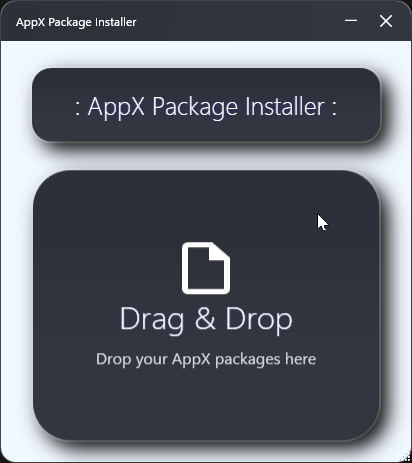
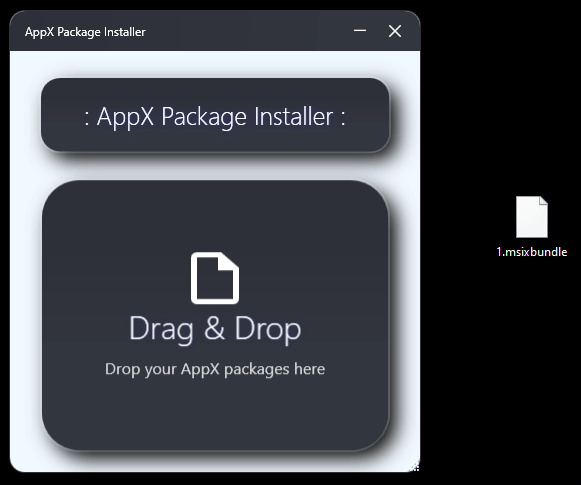

<p align="center">
 
 <h2 align="center">AppX Package Installer</h2>
 <p align="center">Modern MSIX/AppX Package Installer for Windows 10/11</p>
</p>

<p align="center">
  <a href="https://github.com/EXLOUD/AppX-Package-Installer/releases"></a>
  <a href="https://github.com/EXLOUD/AppX-Package-Installer/issues"></a>
  
  <a href="https://github.com/EXLOUD/AppX-Package-Installer/actions"></a>
  <a href="https://github.com/EXLOUD/AppX-Package-Installer/blob/main/LICENSE"></a>
</p>

<p align="center">
  <a href="#-what-is-appx-package-installer">What is it?</a> | <a href="#-features">Features</a> | <a href="#-how-to-use">How to use</a> | <a href="#-supported-formats">Formats</a> | <a href="#-building">Building</a>
</p>

---

## 🎯 What is AppX Package Installer?

AppX Package Installer is a modern, user-friendly Windows application designed to simplify the installation of AppX and MSIX packages. With its intuitive drag-and-drop interface, automatic dependency management, and sleek design, it makes package installation effortless for both developers and end users.

Unlike complex command-line tools, this application provides a visual interface that automatically handles package dependencies, architecture compatibility, and license management.

## ✨ Features

<details>
<summary>Click to expand features</summary>

### 🎨 User Experience
- **Intuitive Drag & Drop Interface** - Simply drag your AppX files into the application
- **Real-time Installation Progress** - Live status updates with visual feedback
- **Modern UI Design** - Clean, gradient-based interface with smooth animations
- **Three Visual States** - Empty, Loading, and Success states with indicators

### 🔧 Technical Capabilities
- **Multiple Format Support** - `.appx`, `.appxbundle`, `.msix`, `.msixbundle`
- **Smart Package Detection** - Automatically identifies dependencies, main apps, and bundles
- **Architecture Compatibility** - System architecture detection and filtering
- **Automatic License Handling** - Searches and applies license files automatically
- **Intelligent Installation Order** - Dependencies → Apps → Bundles

### 🛡️ System Integration
- **PowerShell Integration** - Uses native Windows PowerShell commands
- **Administrator Support** - System-wide installation with elevated privileges
- **Error Handling** - Graceful error management with user-friendly messages
- **Cancellation Support** - Ability to cancel long-running installations

</details>

## 🚀 How to use?

There are several ways to use AppX Package Installer:

- [Download from Releases](#41-download-release)
- [Build from Source](#42-build-from-source)

### 4.1 Download Release

<details>
<summary>Click to expand</summary>

The easiest way to get started is to download the pre-built executable.

#### 4.1.1 Download

**Download** the latest release from [GitHub Releases](https://github.com/EXLOUD/AppX-Package-Installer/releases).

#### 4.1.2 Installation

1. **Extract** the downloaded archive
2. **Run** the executable as Administrator (recommended)
3. **Start** installing your AppX packages!

#### 4.1.3 Usage



1. **Launch** the application (preferably as Administrator)
2. **Drag and drop** your AppX package files into the main window
3. **Wait** for automatic installation - the app handles everything
4. **Receive** success notification when installation is complete

</details>

### 4.2 Build from Source

<details>
<summary>Click to expand</summary>

If you prefer to build the application yourself, follow these steps.

#### 4.2.1 Prerequisites

1. **Visual Studio 2019 or later** - Required for building the project
2. **.NET Framework 4.7.2 SDK** - Must be installed
3. **Windows 10 SDK** - For Windows API compatibility

#### 4.2.2 Build Steps

```bash
# Clone the repository
git clone https://github.com/EXLOUD/AppX-Package-Installer.git
cd AppX-Package-Installer

# Open in Visual Studio
start AppX-Package-Installer.sln

# Or build from command line
msbuild AppX-Package-Installer.sln /p:Configuration=Release
```

#### 4.2.3 Run

1. Build the project in Visual Studio
2. Navigate to `bin/Release/` directory
3. Run the executable as Administrator (recommended)

</details>

## 📦 Supported Formats

The installer supports multiple package formats with automatic detection:

### 4.3 Package Types

| Format | Description | Auto-Detection | Example |
|--------|-------------|----------------|---------|
| `.appx` | Standard Application Package | ✅ APP/DEP | `MyApp.appx` |
| `.appxbundle` | Application Bundle Package | ✅ BUNDLE | `MyApp.appxbundle` |
| `.msix` | Modern Application Package | ✅ APP/DEP | `MyApp.msix` |
| `.msixbundle` | Modern Bundle Package | ✅ BUNDLE | `MyApp.msixbundle` |

### 4.4 Installation Priority

The installer automatically handles package dependencies by installing in the correct order:

1. **Dependencies** (VCLibs, NET, Xaml, WinJS) - Installed first
2. **Main Applications** - Installed second  
3. **Bundles** - Installed last

### 4.5 License Handling

The application can automatically detect and apply license files:

- Place `.xml` license files in the same directory as your packages
- The installer will automatically find and apply them during installation
- No manual license management required

## 💻 System Requirements

| Component | Requirement |
|-----------|-------------|
| **Operating System** | Windows 10/11 |
| **Framework** | .NET Framework 4.7.2+ |
| **PowerShell** | Windows PowerShell (built-in) |
| **Privileges** | Administrator rights (recommended) |
| **Architecture** | x86, x64, ARM64 |

## 🔨 Building

<details>
<summary>Click to expand building instructions</summary>

### Prerequisites

Make sure you have the following installed:

- Visual Studio 2019 or later
- .NET Framework 4.7.2 SDK
- Windows 10 SDK

### Project Structure

```
AppX-Package-Installer/
├── src/                    # Source code
│   ├── MainWindow.xaml     # Main UI
│   ├── MainWindow.xaml.cs  # UI logic
│   └── ...                 # Other source files
├── assets/                 # Images and resources
├── bin/                    # Build output
├── docs/                   # Documentation
├── LICENSE                 # MIT License
└── README.md              # This file
```

### Build Configuration

The project is configured for:
- **Target Framework**: .NET Framework 4.7.2
- **Platform Targets**: x86, x64
- **Output Type**: Windows Application

</details>

## 🔧 Troubleshooting

Why isn't my installation working?

### 7.1 Common Issues

<details>
<summary>Installation Fails</summary>

**Possible causes:**
- Not running as Administrator
- Package incompatible with Windows version
- Corrupted package file
- Missing dependencies

**Solutions:**
- Run the application as Administrator
- Check package compatibility
- Re-download the package
- Install required dependencies manually

</details>

<details>
<summary>Drag & Drop Not Working</summary>

**Possible causes:**
- Incorrect file extensions
- Security restrictions
- Application not running as Administrator

**Solutions:**
- Verify files have correct extensions (.appx, .msix, etc.)
- Run as Administrator
- Check Windows security settings

</details>

<details>
<summary>PowerShell Errors</summary>

**Possible causes:**
- PowerShell execution policy restrictions
- Outdated PowerShell version
- Missing Windows features

**Solutions:**
- Check PowerShell execution policy
- Update PowerShell via Windows Update
- Enable PowerShell in Windows Features

</details>

### 7.2 Getting Help

If you encounter issues:

1. Check the [Issues](https://github.com/EXLOUD/AppX-Package-Installer/issues) page
2. Search for existing solutions
3. Create a new issue with detailed information including:
   - Windows version
   - Package types you're trying to install
   - Error messages
   - Steps to reproduce

## 🤝 Contributing

### 8.1 Suggestions

If you encounter problems, you can report them on the [Issues](https://github.com/EXLOUD/AppX-Package-Installer/issues) page. Many enthusiastic developers and GitHub users will help you.

This project welcomes contributions and suggestions. You can make suggestions in [Issues](https://github.com/EXLOUD/AppX-Package-Installer/issues), or submit a pull request 😄

### 8.2 Development Workflow

1. **Fork** the repository
2. **Create** a feature branch (`git checkout -b feature/amazing-feature`)
3. **Commit** your changes (`git commit -m 'Add amazing feature'`)
4. **Push** to the branch (`git push origin feature/amazing-feature`)
5. **Open** a Pull Request

### 8.3 Thanks

Thank you to all contributors who have helped improve this project and to the Windows development community for their support.

## 🏆 Acknowledgments

- Thanks to all contributors who have helped improve this project
- Special thanks to the Windows development community
- Icons and assets from various open-source projects
- Inspired by modern Windows application design principles

---

## 📄 License

The code is available under the [MIT license](https://github.com/EXLOUD/AppX-Package-Installer/blob/main/LICENSE).

## 👨‍💻 Author

<div align="center">

**EXLOUD**

[](https://github.com/EXLOUD)

*Made with ❤️ for the Windows development community*

</div>

---

<div align="center">

**⭐ If you find this project helpful, please consider giving it a star! ⭐**

</div>
